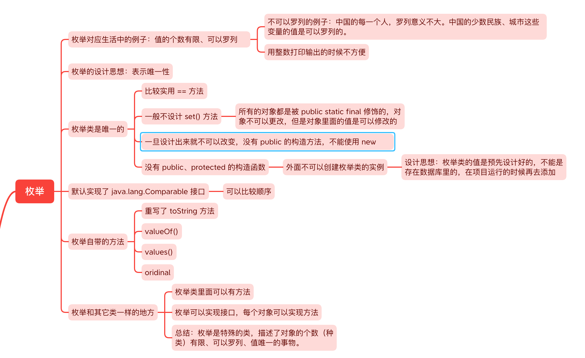
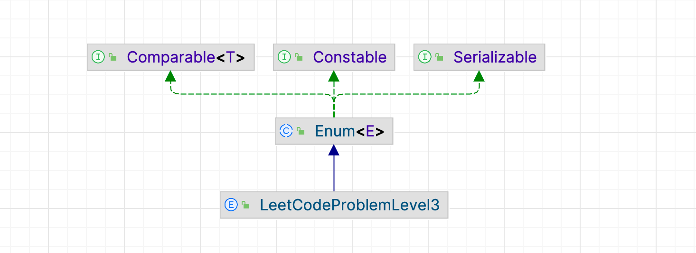

# 枚举



## 综述

**枚举**在语义上表示**有限个**、**离散的**、**能罗列**的值，生活中常见例子如下：

- 性别：男/女
- 四季：春夏秋冬
- 月份：1-12月
- 每周天数：周一~周日
- 部分系统中指代的工具：报销系统中出勤工具类别
- web系统中请求状态码：
  - 正确（200）
  - 重定向（3xx）
  - 客户端错误（4xx）
  - 服务端错误（5xx）

枚举是有限对象的自定义类型，使用关键字`enum`定义，其命名规则同普通类。
编译后生成一个继承自`java.lang.Enum`的子类，为每个枚举常量创建对应的静态实例，并将其放入一个静态数组中。



```Java
public abstract class Enum<E extends Enum<E>> implements Constable, Comparable<E>, Serializable {
    private final String name;
    
    public String toString() {
        return name;
    }
}
```

> 枚举类重写`equals()`和`hashCode()`方法，并实现`Serializable`接口，保证枚举对象的**唯一性**和**序列化一致性**。

通过在枚举类中添加`get`和`set`方法，可以通过构造函数给每一个对象的成员变量赋值。
枚举对象的值未被`final`修饰时，可以修改，但破坏了枚举类的语义和约束，并不推荐。
通常来说，枚举类的对象属性值都被`final`修饰，并在构造器中所初始化。

## 与普通类对象的区别

- 枚举类对象间的比较使用`==`，而不是`equals()`
- 枚举类不允许使用`new`创建对象
  - 枚举类对象无法在外部实例化，**即便使用反射也不能创建枚举类对象**
  - 由此特性，枚举类适合实现设计模式中的**单例模式**

枚举类实现单例：

```Java
class Resource {
}

public enum Temp {
    INSTANCE;
    private Resource instance = null;
    
    Temp() {
        instance = new Resource();
    }
    
    public Resource getInstance() {
        return instance;
    }
}
```

获取已有类的单例实例，通过`Temp.INSTANCE.getInstance()`

## 枚举的自带方法

枚举类默认继承`java.lang.Enum`，常见方法如下：

- `name()`：返回枚举对象的字符串表示

```Java
public class Solution {
    
    public static void main(String [] args) {
        System.out.println(TempEnum.Tmp);
        
        System.out.println(TempEnum.Tmp.name());
    }
    
}
```

- `values()`：获得一个枚举类里所有的对象

```Java
public class Solution {
    
    public static void main(String [] args) {
        TempEnum [] enumValues = TempEnum.values();
        Arrays.stream(TempEnum.values()).forEach(System.out::println);
    }
    
}
```

> **注意**：在`java.lang.Enum`的源码中，`Enum`里没有`values()`方法，可以使用是因为编译枚举类时，将枚举类转化为`java.lang.Enum`类的子类。
> 
> 反编译命令：`javap ./TempEnum.class`
> 
> output:
> ```Java
> Compiled from "TempEnum.java"
> public abstract class cn.Note.TempEnum extends java.lang.Enum<cn.Note.TempEnum> implements cn.Note.EnumTemp {
>   public static final cn.Note.TempEnum Tmp;
>   public static cn.Note.TempEnum[] values();
>   public static cn.Note.TempEnum valueOf(java.lang.String);
>   public java.lang.String getName();
>   public java.lang.String getDescription();
>   static {};
> }
>```

- `valueOf()`：枚举类提供的静态方法，通过字符串得到枚举类的对象。

```Java
public class Solution {
    
    public static void main(String [] args) {
        TempEnum t1 = TempEnum.valueOf("TEST");
        TempEnum t2 = TempEnum.TEST;
        System.out.println(t1 == t2);  // true
    }
    
}
```

- `ordinal()`：返回枚举对象在枚举类中声明的次序，从`0`开始
- `compareTo(E o)`：比较枚举对象在枚举类中声明的次序，依据`ordinal()`返回的值进行比较
- `getDeclaringClass()`：返回枚举对象的枚举类（反射）

```Java
public class Solution {
    
    public static void main(String [] args) {
        Class<TempEnum> declaringClass = TempEnum.TEST.getDeclaringClass();
        System.out.println(declaringClass);  // class cn.Note.TempEnum
    }
    
}
```

## 枚举类的实现类实现各自的方法

由于枚举类默认继承`java.lang.Enum`，所以枚举可以实现接口，有以下两种方式：

- 枚举类直接实现接口，仅需在枚举中实现抽象方法
- 枚举值实现接口，每个枚举值都需要实现抽象方法

## EnumSet与EnumMap

`EnumSet`和`EnumMap`是Java中针对枚举类型设计的集合类

`EnumSet`基于位向量实现，将每个枚举值映射到一个二进制位上，由于枚举类型的数量固定，因此`EnumSet`可以通过位运算来高效地实现集合操作。同时，由于枚举类型不可变，因此`EnumSet`的元素也不可变，意味着`EnumSet`可以保证线程安全

`EnumMap`基于数组实现，与普通数组不同的是，`EnumMap`中的每一个元素都由枚举类型的元素作为下标索引，意味着`EnumMap`的查找和更新操作时间复杂度均为$$O(1)$$,空间效率也更高

- `java.util.EnumSet`只能包含特定枚举类的对象`Set`
- `java.util.EnumMap`键只能是特定枚举类的对象的`Map`

当一个元素存入哈希表时，需要计算其哈希值，而枚举类的对象个数有限，在定义枚举类时已罗列好枚举类的对象，因此存入`Set`或者`Map`的时候，不需要计算哈希值，仅使用`ordinal()`方法的返回值即可
