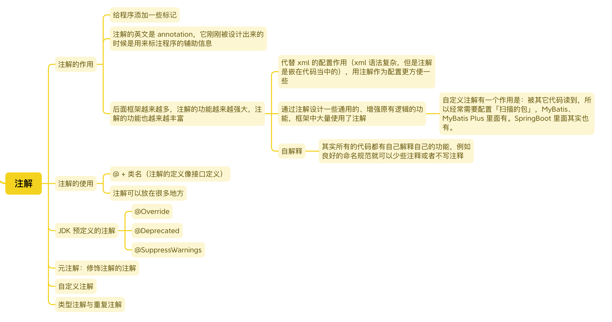

# 注解



注解和泛型一样，是对代码添加的标记，可以被其他程序所读取，用以实现功能和业务逻辑
使用注解可以把一些附加的、通用的方法**动态地**附加在原有代码上，而**不需要修改原有代码**

## 注解的作用

- 增强语义
- 增强功能
- 简化配置

早期的Spring通过XML文件完成配置，随后才使用注解作为配置，方便使用。常见的框架的设计有很多通过**自定义注解+反射**实现各种功能

## 常见注解

### @Override 标记重写

```Java
@Target(ElementType.METHOD)
@Retention(RetentionPolicy.SOURCE)
public @interface Override {
}
```

> `@Target`和`@Retenion`是修饰注解的注解，也叫**元注解**
> 
>`METHOD`表示`@Override`注解用于修饰方法
>
>`SOURCE`表示`@Override`只保留在源代码阶段，编译后不存在于字节码文件中

### @Deprecated 标记过时

被`@Deprecated`标记的目标，表示过时，即**不推荐使用**。在IDE中，通常会对其画上横线，并且这类方法中通常会阐明弃用的原因和推荐使用的其他类或方法

```Java
@Documented
@Retention(RetentionPolicy.RUNTIME)
@Target(value={CONSTRUCTOR, FIELD, LOCAL_VARIABLE, METHOD, PACKAGE, MODULE, PARAMETER, TYPE})
public @interface Deprecated {
    
    String since() default "";

    boolean forRemoval() default false;
}
```

>`@Retention(RetentionPolicy.RUNTIME)`表示注解`@Deprecated`保留到程序运行时

>`Deprecated`可以修饰于构造函数`CONSTRUCTOR`、属性`FIELD`、局部变量`LOCAL_VARIABLE`、方法`METHOD`、包`PACKAGE`、模块`MODULE`（JDK9+）、参数`PARAMETER`、类`TYPE`

> 注解的属性是注解携带的额外信息，用于实现个性化配置。例如`since()`和`forRemoval()`(JDK9+)

### @SuppressWarnings 抑制编译警告

```Java
@SuppressWarnings("unchecked")
public List<String> getStrings() {
    return (List<String>) someObject.get();     // @SuppressWarnings("unchecked")注解用于抑制编译器关于将Object类型强制转换为List<String>类型的警告
}
```

> `@SuppressWarnings`注解仅用于抑制编译器警告或错误。它不会使代码不安全或不正确。如果不确定编译器警告或错误的根源，则不应使用`@SuppressWarnings`注解

### @FunctionalInterface声明函数式接口

```Java
@Documented
@Retention(RetentionPolicy.RUNTIME)
@Target(ElementType.TYPE)
public @interface FunctionalInterface {
}
```

> 标注了`@FunctionalInterface`的接口只能包含一个未实现的方法，该接口可以有多个默认方法，也可以有多个静态方法

> 枚举类`ElementType`里没有单独表示接口的值（对象）

## 元注解

- `@Retention`表示注解保留到什么时候
- `@Target`表示注解可以标注在什么地方
- `@Documented`表示在使用`javadoc`生成文档的时候，被修饰的注解会被记录下来
- `@Inherited`表示被修饰的类的注解的子类也继承了该注解。SpringBoot的启动类上使用的注解`@SpringBootApplication`就是被`@Inherited`修饰的
- `@Repeatable`表示重复注解，相同的注解可以重复修饰目标，这是一个语法糖，是`Java8`的新特性。当注解属性是数组的时候，配置可能过长，可读性较差

例如：Swagger3提供的注解`io.swagger.v3.oas.annotations.Parameters`：

```Java
@Target({ElementType.METHOD, ElementType.ANNOTATION_TYPE})
@Retention(RetentionPolicy.RUNTIME)
@Inherited
public @interface Parameters {
    Parameter[] value() default {};
}
```

```Java
@Parameters({@Parameter(name = "curPage", description = "当前第几页", required = true), @Parameter(name = "pageSize", description = "每页多少条数据", required = true)})
@Operation(summary = "分页查询文章数")
@GetMapping("/list")
public Result<Page<Article>> list(int curPage, int pageSize) {
    return Result.success(articleService.selectPage(curPage, pageSize));
}
```

> 所以`@Parameter`被设计为重复注解：

```Java
@Parameter(name = "curPage", description = "当前第几页", required = true)
@Parameter(name = "pageSize", description = "每页多少条数据", required = true)
@Operation(summary = "分页查询文章数")
@GetMapping("/list")
public Result<Page<Article>> list(int curPage, int pageSize) {
    return Result.success(articleService.selectPage(curPage, pageSize));
}
```

```Java
package io.swagger.v3.oas.annotations;

@Target({PARAMETER, METHOD, FIELD, ANNOTATION_TYPE})
@Retention(RetentionPolicy.RUNTIME)
@Repeatable(Parameters.class)
@Inherited
public @interface Parameter {
    ......
}
```

## 自定义注解

注解是一个特殊的类，类似于接口（编译后为.class文件），被`@interface`所修饰，命名规则同Java类

> 使用反射读取注解信息：

```Java
import java.lang.annotation.Documented;
import java.lang.annotation.ElementType;
import java.lang.annotation.Retention;
import java.lang.annotation.RetentionPolicy;
import java.lang.annotation.Target;

@Documented
@Target({ElementType.TYPE, ElementType.METHOD, ElementType.PARAMETER})
@Retention(value = RetentionPolicy.RUNTIME)
public @interface TmpAnnotation {

    String name();

    String info();

    TmpEnum level();
    
    //  注解TmpAnnotation被@Retention修饰，说明其保留到程序运行时
}
```

### 解析自定义注解

注解是程序的标注，想获得注解信息，需要先获得被注解标注的程序对象，即通过Java的反射机制，通过`Class`对象可以获得标记在类上的注解信息

```Java
import java.lang.annotation.Annotation;

public class AnnotationExample {

    public static void main(String[] args) throws Exception {
        Class<?> clazz = Class.forName("cn.Note.Question");
        // 获取当前类标记的所有注解
        Annotation[] annotations = clazz.getAnnotations();
        System.out.println("注解的数量 => " + annotations.length);
        System.out.println("注解的信息 => ");
        for (Annotation annotation : annotations) {
            // 判断是否是指定的注解
            if (clazz.isAnnotationPresent(TmpAnnotation.class)) {
                LCAnnotation tmpAnnotation = (TmpAnnotation) annotation;
               
                String name = tmpAnnotation.name();
                System.out.println(name);

                String info = tmpAnnotation.info();
                System.out.println(info);
            }
        }
    }
}
```
