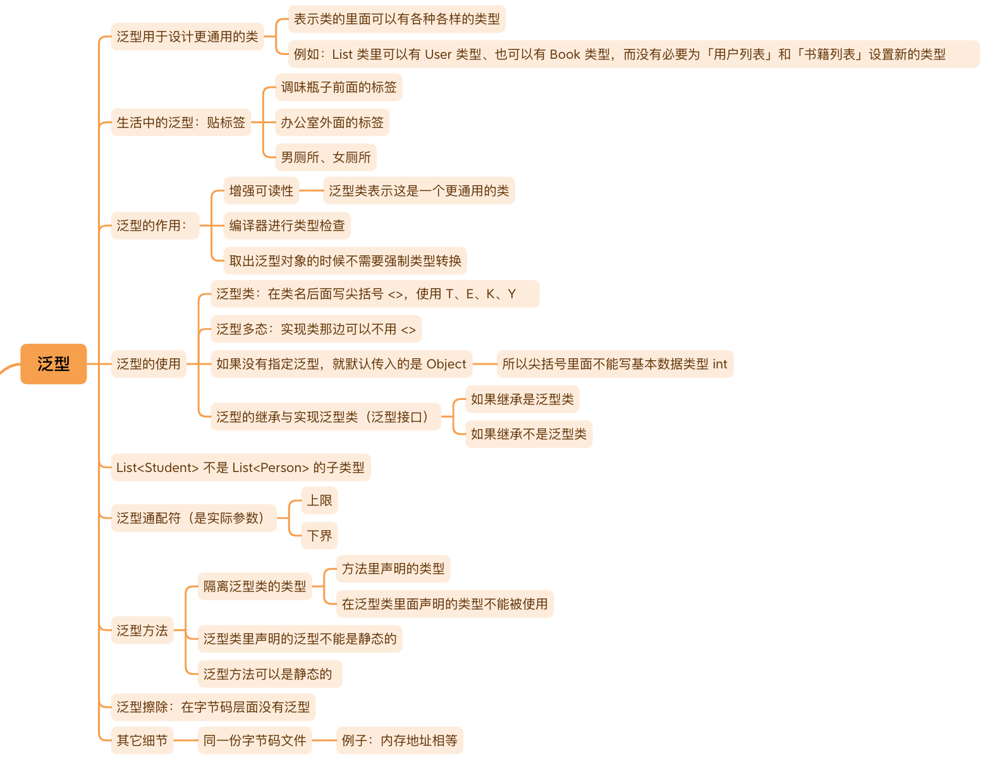

# 泛型



## 泛型解决的问题

有时候，一个类里面的信息（成员变量或成员方法）是不确定的，需要依据使用需求来确定，泛型类解决了需要用到的类里面的类可以是变化的问题

> 泛型是**参数化类型**，可以理解为类的标签，是依附于一个确定的类里面的信息

泛型不像变量的值是变化的，表示一个类的里面可能变化的类型。标记了泛型的类，有更好的语义，编译器会检查加入的类型是否为所标记的类型，如果没有泛型，取出元素时需要强制类型转换，具有风险

常规使用泛型的地方是需要提供通用的功能，例如框架开发和工具类的使用。比如web中`Result`类的设计：

- 状态码`code`：如果返回正确的信息，值为200；如果存在异常，则自定义整数值，前端依据此值执行相应的逻辑
- 针对状态码的说明`message`：如果返回信息正确，一般`message`值为空，如果异常，则返回对应`code`的说明
- 返回数据`data`：如果返回信息正确，`data`内存有前端所需数据，此处可以使用泛型

```Java
@Data
@ToString
@Accessors(chain = true)
public class Result<T> {

    private int code;

    private String message;

    private T data;

    private Result() {
    }

    private Result(int code, String message) {
        this.code = code;
        this.message = message;
    }

    private Result(int code, String message, T data) {
        this.code = code;
        this.message = message;
        this.data = data;
    }

    // 泛型方法
    public static <T> Result<T> success(T data) {
        return new Result<>(CommonCode.SUCCESS.getCode(), CommonCode.SUCCESS.getMessage(), data);
    }
    
	// 泛型方法
    public static <T> Result<T> error(BaseCode baseCode) {
        return new Result<>(baseCode.getCode(), baseCode.getMessage());
    }

    // 泛型方法
    public static <T> Result<T> error(int code, String message) {
        return new Result<>(code, message);
    }

}
```

> 在一个类的后面使用`<>`所标识的类为泛型类。通常在`<>`内使用`T`表示`T`是一个可变的类型
> > `T`表示`Type`，`E`表示`Element`，`K`表示`Key`，`V`表示`Value`

- 泛型出现的意义是：这个类或接口里存在一些信息是可以变化的，由开发者指派具体类型；泛型不是内部类，内部类是确定的类型，而泛型是不确定的类型
- 一个类里面用的的类可能是变化的，所以泛型的作用是让**类型需要成为变量**，也叫参数化类型
- 有了泛型后，编译器会检查编译错误，方便编码也增强语义

## 泛型类、泛型接口、泛型方法

### 泛型类

一个成员是泛型，例如：

```Java
// Bottle 瓶
public class Bottle<T> {

    /**
     * T 表示不确定的类型，它可以代表所有类型
     * 这里的 T 可以是「碳酸饮料」类，可以是「油」类，可以是「奶」类，也可以是「纯净水」类，由使用者确定
     */
    private T t;

    /**
     * 容量
     */
    private int capacity;

    public void setT(T t) {
        this.t = t;
    }

    public T getT() {
        return t;
    }

    public void setCapacity(int capacity) {
        this.capacity = capacity;
    }

    public int getCapacity() {
        return capacity;
    }

    public Bottle() {
    }

    public Bottle(T t, int capacity) {
        this.t = t;
        this.capacity = capacity;
    }
    
}
```

两个成员是泛型，例如`javafx.util.Pair`：

```Java
package com.sun.tools.javac.util;

import java.util.Objects;

/** A generic class for pairs.
 *
 *  <p><b>This is NOT part of any supported API.
 *  If you write code that depends on this, you do so at your own risk.
 *  This code and its internal interfaces are subject to change or
 *  deletion without notice.</b>
 */
public class Pair<A, B> {

    public final A fst;
    public final B snd;

    public Pair(A fst, B snd) {
        this.fst = fst;
        this.snd = snd;
    }

    public String toString() {
        return "Pair[" + fst + "," + snd + "]";
    }

    public boolean equals(Object other) {
        return other instanceof Pair<?,?> pair &&
            Objects.equals(fst, pair.fst) &&
            Objects.equals(snd, pair.snd);
    }

    public int hashCode() {
        if (fst == null) return (snd == null) ? 0 : snd.hashCode() + 1;
        else if (snd == null) return fst.hashCode() + 2;
        else return fst.hashCode() * 17 + snd.hashCode();
    }

    public static <A,B> Pair<A,B> of(A a, B b) {
        return new Pair<>(a,b);
    }
}
```

### 泛型的继承

如果在继承的时候，父类不写具体的类型，子类需要指定类型参数，并且与父类的类型参数一致：

```Java
class Tmp<T> extends Rst<T> {
    ...
}
```

子类还可以额外声明类型参数：

```Java
class Tmp<T, E> extends Rst<T> {
    ...
}
```

> 子类可以不确定，就需要把父类不确定的类型参数传递下来

如果在继承的时候，父类声明了具体的类型，子类则不需要指定类型参数，如果子类有自己额外的类型参数可以额外声明：

```Java
class Tmp extends Rst<User> {
    ...
}
```

### 泛型接口

泛型接口的实现规则与泛型继承是一样的，例如`com.baomidou.mybatisplus.core.mapper.BaseMapper`：

```Java
public interface BaseMapper<T> extends Mapper<T> {
    int insert(T entity);

    int deleteById(Serializable id);

    int deleteById(T entity);
    
    ...
}
```

使用时，将`T`置换为一个确定的类：

```Java
import com.baomidou.mybatisplus.core.mapper.BaseMapper;
import cn.Note.entity.Article;

import java.util.List;

public interface ArticleMapper extends BaseMapper<Article> {

    List<Article> queryAll();

    void increaseViewNum(int articleId);

    void increaseVoteNum(int articleId);
}
```

### 泛型方法

泛型方法不是泛型类里的方法。标注了泛型的方法是泛型方法，类似泛型类的定义：如果一个方法的里面（参数或返回值）有一些类型是可以通用的，那么这样的方法称为泛型方法

例如：`java.util.Arrays.copyOf()`：

```Java
public static <T> void sort(T[] a, Comparator<? super T> c) {
    if (c == null) {
        sort(a);
    } else {
        if (LegacyMergeSort.userRequested)
            legacyMergeSort(a, c);
        else
            TimSort.sort(a, 0, a.length, c, null, 0, 0);
    }
}
```

- 泛型类和泛型方法都是为了设计更通用的功能提供使用
  - 泛型类：类的成员变量可以是不同的类型
  - 泛型方法：方法的参数可以接受不同的类型
- 泛型方法可以存在于非泛型类中

## 泛型通配符

```Java
import java.util.ArrayList;
import java.util.List;

public class Solution {

    public static int calculateSum(List<?> questions) {
        int sum = 0;
        for (Object object : questions) {
            Algorithm algorithm = (Algorithm) object;
            sum += algorithm.getAmount();
        }
        return sum;
    }

    public static void main(String[] args) {
        List<BinarySearch> binarySearchList = new ArrayList<>();
        List<TwoPoint> twoPointList = new ArrayList<>();

        calculateSum(binarySearchList);
    }
}
```

### 泛型上限与下限

泛型增加了类（接口）的使用的灵活性，泛型通配符则是对其进行限制

泛型上限指的是限制泛型类型的参数必须是指定类型或指定类型的子类。例如，一个泛型类`Box<T extends Number>`，其中`Number`，为其上限，表示泛型类型参数必须为`Number`或其子类

泛型下限则是指定泛型类型参数必须为指定类型或指定类型的超类。例如，一个泛型类`Box<T super Integer>`，其中`Integer`为其下限，意味着泛型类型参数必须是`Integer`或其超类

在泛型方法中也可以使用泛型上限和下限来限制类型参数的范围，泛型上下限的使用可以让泛型代码更加灵活和安全，减少类型转换的错误

```Java
import java.util.ArrayList;
import java.util.List;

public class Solution {

    public static int calculateSum(List<? extends Algorithm> questions) {
        int sum = 0;
        for (Algorithm algorithm : questions) {
            sum += algorithm.getAmount();
        }
        return sum;
    }
    // 取出List中的元素时，不需要类型转换
    public static void main(String[] args) {
        List<BinarySearch> binarySearchList = new ArrayList<>();
        List<TwoPoint> twoPointList = new ArrayList<>();

        calculateSum(binarySearchList);
    }
}
```

```Java
import java.util.ArrayList;
import java.util.List;

public class Solution {

    public static void main(String[] args) {
        // 创建一个存放 Number 或其父类的 List
        List<? super Number> numberList = new ArrayList<>();

        // 可以添加 Number 及其子类 Integer 和 Double
        numberList.add(new Number() {
            @Override
            public int intValue() {
                return 42;
            }

            @Override
            public long longValue() {
                return 42;
            }

            @Override
            public float floatValue() {
                return 42;
            }

            @Override
            public double doubleValue() {
                return 42;
            }
        });

        numberList.add(new Integer(10));
        numberList.add(new Double(3.14));

        // 读取元素时，只能保证是 Object 类型
        Object firstElement = numberList.get(0);

        System.out.println("First Element: " + firstElement);
    }
}
```
