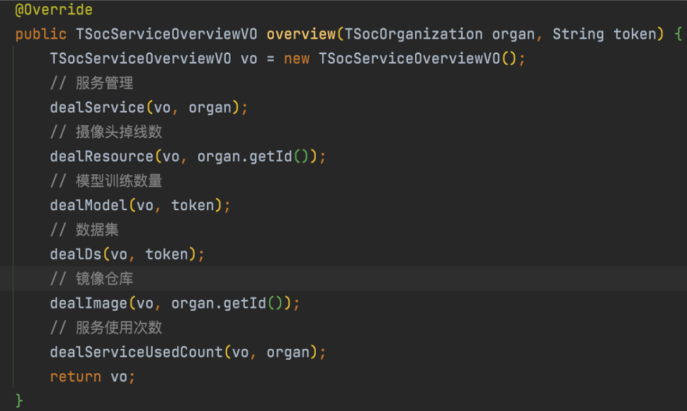

# SpringBoot 优化

## 定义配置文件信息

有时候我们为了统一管理会把一些变量放到yml配置文件中；而不是到处设置“魔数”，一旦需要修改，只需要修改配置文件即可，不需要整个项目去搜索替换

- 例如

```yaml
developer:
  name:
  website:
  id:
  number:
```

用`@ConfigurationProperties`代替`@Value`

- 使用方法

定义对应字段的实体

```Java
@Data
// 指定前缀
@ConfigurationProperties(prefix = "developer")
@Component
public class DeveloperProperty {
    private String name;
    private String website;
    private String qq;
    private String phoneNumber;
}
@Data
// 指定前缀
@ConfigurationProperties(prefix = "developer")
@Component
public class DeveloperProperty {
    private String name;
    private String website;
    private String qq;
    private String phoneNumber;
}
```

注入bean

```Java
@RestController
@RequiredArgsConstructor
public class PropertyController {
 
    final DeveloperProperty developerProperty;
 
    @GetMapping("/property")
    public Object index() {
       return developerProperty.getName();
    }
}
```

## 用@RequiredArgsConstructor代替@Autowired

bean有三种方式（set注入, 构造器注入, 注解注入），Spring推荐我们使用构造器的方式注入Bean

```Java
@RestController
public class PropertyController {
    final DeveloperProperty developerProperty;
    
    @GetMapping({"/property"})
    public Object index() {
        return this.developerProperty.getName();
    }
    
    public PropertyController(DeveloperProperty developerProperty) {
        this.developerProperty = developerProperty;
    }
}
```

## 代码模块化

实际开发中要善于拆分自己的接口或方法，做到一个方法只处理一种逻辑



